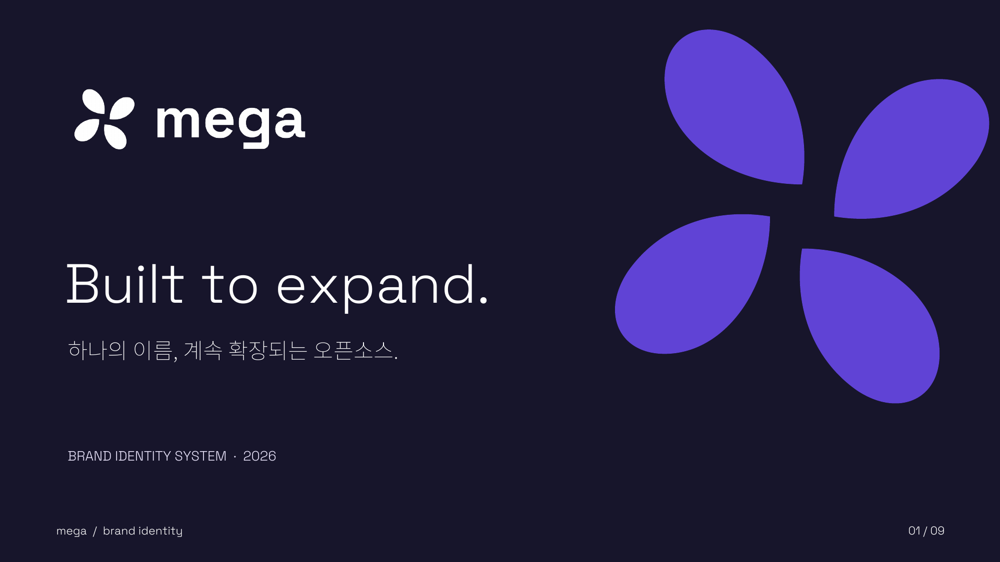

# mega BI



**mega**는 Codeblack-Inc의 오픈소스 제품을 묶는 브랜드입니다. 네 개의 둥근 조각이 열린 중심을 공유하는 심벌로, 서로 다른 프로젝트가 함께 확장되는 모습을 표현합니다. 이 저장소에는 `mega`, `mega-ui`, `mega-ppt`의 로고와 사용 가이드를 모았습니다.

**[mega 브랜드 사이트 보기 →](https://codeblack-inc.github.io/mega-bi/)** · [mega-ui](https://mega-ui-two.vercel.app/) · [mega-ppt](https://codeblack-inc.github.io/mega-ppt/)

## 바로 사용하기

| 용도 | 권장 파일 |
| --- | --- |
| 밝은 배경의 기본 로고 | [SVG](assets/svg/mega-logo.svg) · [PNG](assets/png/mega-logo.png) |
| 어두운 배경의 흰색 로고 | [SVG](assets/svg/mega-logo-inverse.svg) · [PNG](assets/png/mega-logo-inverse.png) |
| 단색 인쇄용 로고 | [SVG](assets/svg/mega-logo-ink.svg) · [PNG](assets/png/mega-logo-ink.png) |
| 배경이 포함된 로고 이미지 | [SVG](assets/svg/mega-logo-on-ink.svg) · [PNG](assets/png/mega-logo-on-ink.png) |
| 심벌만 사용 | [SVG](assets/svg/mega-symbol.svg) · [PNG](assets/png/mega-symbol.png) |
| `mega-ui` 로고 | [SVG](assets/svg/mega-ui.svg) · [PNG](assets/png/mega-ui.png) |
| `mega-ppt` 로고 | [SVG](assets/svg/mega-ppt.svg) · [PNG](assets/png/mega-ppt.png) |

웹과 문서에서는 크기에 관계없이 선명한 **SVG를 우선** 사용하세요. SVG를 지원하지 않는 환경에는 PNG를 사용하면 됩니다. 흰색 로고 파일은 투명 배경이므로 어두운 영역 위에 배치해야 합니다.

```html

```

## 브랜드 구조

- **mega**: 모든 프로젝트에 공통으로 쓰는 마스터 브랜드
- **mega-ui**: 인터페이스와 컴포넌트를 위한 제품명
- **mega-ppt**: 프레젠테이션을 위한 제품명

제품명은 항상 **소문자 + 하이픈**으로 표기합니다. 새 제품을 추가할 때는 심벌과 `mega` 워드마크를 유지하고, 접미사에 제품 색을 적용합니다.

## 로고 사용 규칙

1. 로고 주위에는 **심벌 너비의 절반 이상** 여백을 둡니다.
2. 가로 로고는 화면에서 **120px 이상**, 심벌 단독은 **20px 이상** 사용합니다. 파비콘은 제공된 전용 크기를 사용합니다.
3. 밝은 배경에는 기본 로고, 어두운 배경에는 흰색 로고를 사용합니다.
4. 로고를 찌그러뜨리거나 회전하지 않습니다. 임의의 그라디언트, 그림자, 테두리를 추가하지 않습니다.
5. 사진 위에서는 읽기 쉬운 단색 영역을 확보한 뒤 배치합니다.

자세한 배치 예시는 [BI 가이드 PDF](guide/mega-brand-guidelines.pdf)에서 볼 수 있습니다.

## 색상

| 이름 | HEX | 용도 |
| --- | --- | --- |
| Ink | `#17152B` | 본문, 어두운 배경 |
| Violet | `#6043D5` | 마스터 브랜드, `mega-ui` |
| Coral | `#F37055` | `mega-ppt` 강조 |
| Paper | `#F6F5FA` | 밝은 보조 배경 |
| Lilac | `#E8E3FA` | 연한 강조 배경 |
| Muted | `#68657B` | 보조 텍스트 |

개발에는 [CSS 변수](tokens.css) 또는 [디자인 토큰 JSON](tokens.json)을 사용하세요. 작은 글자는 흰색 바탕에 Ink 또는 Muted를, Violet 바탕에는 흰색을 사용합니다.

## 서체

| 역할 | 서체 |
| --- | --- |
| 영문 제목과 워드마크 | [Space Grotesk](https://github.com/floriankarsten/space-grotesk) |
| 한글 본문 | [Noto Sans KR](https://github.com/googlefonts/noto-cjk) |
| 코드와 버전 표기 | [IBM Plex Mono](https://github.com/IBM/plex) |

로고 SVG의 글자는 패스로 변환되어 있어 서체를 설치하지 않아도 같은 모양으로 표시됩니다. 편집 가능한 [발표 템플릿](guide/mega-presentation-template.pptx)은 위 서체를 사용합니다.

## 아이콘과 공유 이미지

- 파비콘: [favicon.ico](assets/png/favicon.ico)
- PNG 아이콘: [16px](assets/png/mega-icon-16.png) · [32px](assets/png/mega-icon-32.png) · [64px](assets/png/mega-icon-64.png) · [128px](assets/png/mega-icon-128.png) · [512px](assets/png/mega-icon-512.png)
- 심벌 단색: [Ink SVG](assets/svg/mega-symbol-ink.svg) · [흰색 SVG](assets/svg/mega-symbol-inverse.svg)
- 소셜 공유 이미지(1200 × 630): `mega-ui` [SVG](assets/social/mega-ui-og.svg) · [PNG](assets/social/mega-ui-og.png), `mega-ppt` [SVG](assets/social/mega-ppt-og.svg) · [PNG](assets/social/mega-ppt-og.png)

에셋을 수정할 때는 SVG와 PNG를 함께 갱신하고, 작은 아이콘과 어두운 배경에서도 식별되는지 확인해 주세요.
